# Class Diagram

Companion to [`TechnicalDesign.md`](./TechnicalDesign.md). Covers the controller, service, repository, entity, and DTO layers, and how they connect. Everything except the DTOs (`ConvertedPurchaseTransactionDto` etc., in the `Models` project) lives in the `Api` project as folders — see `TechnicalDesign.md` §1–§2 for the physical layout; this diagram shows the logical layering regardless of which folder each class sits in. `Guid`/`DateOnly`/`decimal` are used throughout for identifiers, dates, and money per the financial-rigor requirement.

**Note on generics:** Mermaid's class diagram syntax renders `IRepository~TEntity~` as an open generic. In code, `IPurchaseTransactionRepository` and `ICurrencyOptionRepository` each close it over a concrete entity (`IRepository<PurchaseTransaction>` and `IRepository<CurrencyOption>` respectively) — shown generically here for readability.

The image above is an SVG (scales to any zoom level without blurring) rendered from the Mermaid diagram below, for anyone viewing this file without Mermaid support. A high-resolution `ClassDiagram.png` is also in this folder for tools that don't display SVG well (e.g., pasting into Office documents). Edit the Mermaid source, not the images, and re-render both if the diagram changes.

```mermaid
classDiagram
    %% ---------- API layer ----------
    class PurchaseTransactionsController {
        -IPurchaseTransactionService transactionService
        -ICurrencyConversionService conversionService
        +Create(CreatePurchaseTransactionRequest) ActionResult~PurchaseTransactionDto~
        +GetById(Guid id) ActionResult~PurchaseTransactionDto~
        +GetAll() ActionResult~List~PurchaseTransactionDto~~
        +Update(Guid id, UpdatePurchaseTransactionRequest) ActionResult~PurchaseTransactionDto~
        +Delete(Guid id) ActionResult
        +GetConversion(Guid id, string country, string currency) ActionResult~ConvertedPurchaseTransactionDto~
    }

    class CurrenciesController {
        -ICurrencyConversionService conversionService
        -ICurrencyOptionCacheService cacheService
        +GetCountries() ActionResult~List~string~~
        +GetAvailableCurrencies(string country, DateOnly transactionDate) ActionResult~List~CurrencyOptionDto~~
        +TriggerRefresh() ActionResult
    }

    %% ---------- Application / service layer ----------
    class IPurchaseTransactionService {
        <<interface>>
        +CreateAsync(CreatePurchaseTransactionRequest) Task~PurchaseTransactionDto~
        +GetByIdAsync(Guid id) Task~PurchaseTransactionDto~
        +GetAllAsync() Task~List~PurchaseTransactionDto~~
        +UpdateAsync(Guid id, UpdatePurchaseTransactionRequest) Task~PurchaseTransactionDto~
        +DeleteAsync(Guid id) Task~bool~
    }

    class PurchaseTransactionService {
        -IPurchaseTransactionRepository repository
        -IValidator~CreatePurchaseTransactionRequest~ createValidator
        -IValidator~UpdatePurchaseTransactionRequest~ updateValidator
    }

    class ICurrencyConversionService {
        <<interface>>
        +GetConvertedAsync(Guid transactionId, string country, string currencyName) Task~ConvertedPurchaseTransactionDto~
        +GetAvailableCurrenciesAsync(string country, DateOnly transactionDate) Task~List~CurrencyOptionDto~~
    }

    class CurrencyConversionService {
        -IPurchaseTransactionRepository transactionRepository
        -ICurrencyOptionRepository currencyOptionRepository
        -IExchangeRateProvider exchangeRateProvider
        -SelectRate(ExchangeRateLookupResult quote, DateOnly transactionDate) RateSelectionResult
    }

    class RateSelectionResult {
        +decimal ExchangeRate
        +DateOnly RateDate
        +bool IsStale
    }

    class ICurrencyOptionCacheService {
        <<interface>>
        +RefreshAsync(CancellationToken ct) Task
    }

    class CurrencyOptionCacheService {
        -ICurrencyOptionRepository currencyOptionRepository
        -IExchangeRateProvider exchangeRateProvider
    }

    class CurrencyOptionCacheHostedService {
        <<BackgroundService>>
        -ICurrencyOptionCacheService cacheService
        -ICurrencyOptionRepository currencyOptionRepository
        +StartAsync(CancellationToken ct) Task
    }

    %% ---------- Repository layer ----------
    class IRepository~TEntity~ {
        <<interface>>
        +GetByIdAsync(object id) Task~TEntity~
        +GetAllAsync() Task~List~TEntity~~
        +AddAsync(TEntity entity) Task~TEntity~
        +UpdateAsync(TEntity entity) Task
        +DeleteAsync(object id) Task~bool~
    }

    class Repository~TEntity~ {
        #AppDbContext context
    }

    class IPurchaseTransactionRepository {
        <<interface>>
    }

    class PurchaseTransactionRepository

    class ICurrencyOptionRepository {
        <<interface>>
        +GetByCountryAsync(string country) Task~List~CurrencyOption~~
        +ReplaceAllAsync(List~CurrencyOption~ options) Task
    }

    class CurrencyOptionRepository

    %% ---------- External integration ----------
    class IExchangeRateProvider {
        <<interface>>
        +GetLatestRateOnOrBeforeAsync(string country, string currencyName, DateOnly onOrBeforeDate) Task~ExchangeRateLookupResult~
        +FetchAllCurrencyOptionsAsync() Task~List~CurrencyOptionDto~~
    }

    class TreasuryExchangeRateClient {
        -HttpClient httpClient
    }

    class ExchangeRateLookupResult {
        +string Country
        +string CurrencyName
        +DateOnly RecordDate
        +decimal ExchangeRate
    }

    %% ---------- Domain entities ----------
    class PurchaseTransaction {
        +Guid Id
        +string Description
        +DateOnly TransactionDate
        +decimal PurchaseAmountUsd
        +DateTime CreatedAtUtc
    }

    class CurrencyOption {
        +int Id
        +string Country
        +string CurrencyName
    }

    %% ---------- Models (DTOs) ----------
    class CreatePurchaseTransactionRequest {
        +string Description
        +DateOnly TransactionDate
        +decimal PurchaseAmountUsd
    }

    class UpdatePurchaseTransactionRequest {
        +string Description
        +DateOnly TransactionDate
        +decimal PurchaseAmountUsd
    }

    class PurchaseTransactionDto {
        +Guid Id
        +string Description
        +DateOnly TransactionDate
        +decimal PurchaseAmountUsd
    }

    class ConvertedPurchaseTransactionDto {
        +Guid Id
        +string Description
        +DateOnly TransactionDate
        +decimal PurchaseAmountUsd
        +string Country
        +string CurrencyName
        +decimal ExchangeRate
        +DateOnly RateDate
        +bool IsStale
        +decimal ConvertedAmount
    }

    class CurrencyOptionDto {
        +string Country
        +string CurrencyName
    }

    %% ---------- Relationships ----------
    PurchaseTransactionsController --> IPurchaseTransactionService
    PurchaseTransactionsController --> ICurrencyConversionService
    CurrenciesController --> ICurrencyConversionService
    CurrenciesController --> ICurrencyOptionCacheService

    IPurchaseTransactionService <|.. PurchaseTransactionService
    ICurrencyConversionService <|.. CurrencyConversionService

    PurchaseTransactionService --> IPurchaseTransactionRepository
    CurrencyConversionService --> IPurchaseTransactionRepository
    CurrencyConversionService --> ICurrencyOptionRepository
    CurrencyConversionService --> IExchangeRateProvider
    CurrencyConversionService ..> RateSelectionResult
    CurrencyConversionService ..> ExchangeRateLookupResult

    ICurrencyOptionCacheService <|.. CurrencyOptionCacheService
    CurrencyOptionCacheHostedService --> ICurrencyOptionCacheService
    CurrencyOptionCacheHostedService --> ICurrencyOptionRepository
    CurrencyOptionCacheService --> ICurrencyOptionRepository
    CurrencyOptionCacheService --> IExchangeRateProvider

    IRepository~TEntity~ <|-- IPurchaseTransactionRepository
    IRepository~TEntity~ <|-- ICurrencyOptionRepository
    IRepository~TEntity~ <|.. Repository~TEntity~
    Repository~TEntity~ <|-- PurchaseTransactionRepository
    Repository~TEntity~ <|-- CurrencyOptionRepository
    IPurchaseTransactionRepository <|.. PurchaseTransactionRepository
    ICurrencyOptionRepository <|.. CurrencyOptionRepository

    IExchangeRateProvider <|.. TreasuryExchangeRateClient

    PurchaseTransactionRepository ..> PurchaseTransaction
    CurrencyOptionRepository ..> CurrencyOption

    PurchaseTransactionService ..> PurchaseTransactionDto
    PurchaseTransactionService ..> CreatePurchaseTransactionRequest
    PurchaseTransactionService ..> UpdatePurchaseTransactionRequest
    CurrencyConversionService ..> ConvertedPurchaseTransactionDto
    CurrencyConversionService ..> CurrencyOptionDto
```

## Changelog

- Reversed the proactive exchange-rate sync in favor of live per-request lookups (see `TechnicalDesign.md`'s changelog). Removed `ExchangeRateQuote`, `IExchangeRateRepository`/`ExchangeRateRepository`, `IExchangeRateSyncService`/`ExchangeRateSyncService`/`ExchangeRateSyncHostedService`, and `ExchangeRatesController`.
- Added `CurrencyOption` (identity-only: `Country` + `CurrencyName`), `ICurrencyOptionRepository`/`CurrencyOptionRepository`, `ICurrencyOptionCacheService`/`CurrencyOptionCacheService`/`CurrencyOptionCacheHostedService`, and `ExchangeRateLookupResult` (the plain, non-persisted result of a single live Treasury lookup). `CurrencyConversionService` now depends on `IExchangeRateProvider` directly instead of a rate repository. `CurrenciesController` gained `GetCountries()` and `TriggerRefresh()`, and `GetAvailableCurrencies` now takes a `country` parameter.
- ~~Added `ExchangeRateSyncService`, `ExchangeRateSyncHostedService`, and `ExchangeRatesController` for the proactive exchange-rate sync.~~
- ~~Removed the `ExchangeRateSyncState` entity; its watermark is now `IExchangeRateRepository.GetLatestRecordDateAsync()`.~~
- Classes reorganized from separate class-library projects into folders within one `Api` project; the diagram's classes and relationships are unchanged by this, only where they physically live (`TechnicalDesign.md` §1–§2).
