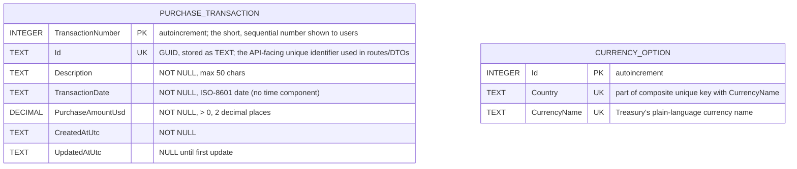

# Database Design

Companion to [`TechnicalDesign.md`](./TechnicalDesign.md). Single SQLite file (`purchasing.db`), created on first run via EF Core migrations.

Two tables:

- `PurchaseTransaction` — Requirement #1 data.
- `CurrencyOption` — a small local cache of every distinct `(Country, CurrencyName)` pair the Treasury Fiscal Data API has ever published, populated by the one-time crawl in `TechnicalDesign.md` §8.1/§10. It holds identities only — no rates, no dates — and only drives the currency picker's candidate list. Conversion and the picker's usability filter both call Treasury live per request instead of reading rates from a local table (`TechnicalDesign.md` §5/§10).

`PurchaseTransaction` has no foreign key to `CurrencyOption`, and neither table stores exchange rate values. A conversion is computed at request time from a single live Treasury lookup as of the transaction's date; nothing is written back onto the transaction.

The image above is an SVG (scales to any zoom level without blurring) rendered from the Mermaid diagram below, for anyone viewing this file without Mermaid support. A high-resolution `DatabaseDesign.png` is also in this folder for tools that don't display SVG well (e.g., pasting into Office documents). Edit the Mermaid source, not the images, and re-render both if the schema changes.

## Notes

- `PurchaseTransaction.TransactionNumber` is the actual database primary key — a plain autoincrementing integer, chosen specifically so users have a short, sequential number to reference (e.g. "PT-000042") instead of a GUID. `Id` (server-generated GUID, v7 where supported) remains the API-facing unique identifier used in every route, DTO, and front-end reference, enforced unique via its own index; `PurchaseTransactionRepository` looks transactions up by `Id`, not the primary key.
- `PurchaseTransaction.TransactionDate`: EF Core `DateOnly`, mapped to `TEXT` in ISO-8601 form — date only, no time-of-day or timezone component.
- `CurrencyOption` has a unique constraint on `(Country, CurrencyName)`. It's refreshed wholesale (delete + re-insert), not upserted incrementally — see `TechnicalDesign.md` §8.1/§10.
- `PurchaseAmountUsd` is `decimal` end to end (C# `decimal` ↔ SQLite `NUMERIC`/`TEXT`), never `REAL`/`double`. Exchange rates themselves are never persisted — they're fetched live per request and used immediately (`TechnicalDesign.md` §10).
- `PurchaseTransaction` delete is a hard `DELETE` — no soft-delete column.

## Changelog

- Added `PurchaseTransaction.TransactionNumber` (autoincrementing `INTEGER`) as the table's actual primary key, replacing `Id` in that role. `Id` (GUID) stays as a required, uniquely-indexed column and remains the identifier used everywhere in the API/UI — this was purely to give users a short, sequential number to reference instead of a raw GUID; nothing about the API surface or DTOs' use of `Id` changed.
- Reversed the previous entry below: `ExchangeRateQuote` (proactively-synced local rate history) removed entirely. Rates are fetched live from Treasury per request instead — see `TechnicalDesign.md`'s changelog for why.
- Added `CurrencyOption`: a small identity-only cache (`Country` + `CurrencyName`, no rates or dates) that exists solely to drive the currency picker without live-querying Treasury for every currency it's ever published.
- ~~`ExchangeRateQuote` changed from lazily-cached-per-lookup to proactively synced.~~
- ~~Removed a third `ExchangeRateSyncState` table; the sync watermark is `MAX(RecordDate)` on `ExchangeRateQuote`.~~
- Trimmed rationale/justification prose throughout in favor of stating the design directly.
