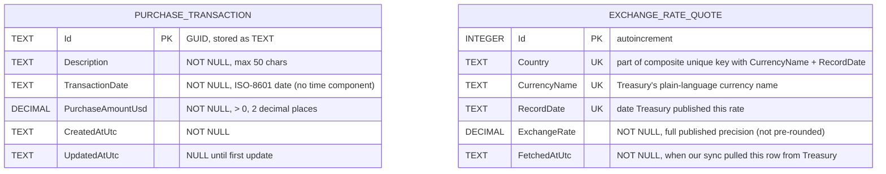

# Database Design

Companion to [`TechnicalDesign.md`](./TechnicalDesign.md). Single SQLite file (`purchasing.db`), created on first run via EF Core migrations.

Two tables:

- `PurchaseTransaction` — Requirement #1 data.
- `ExchangeRateQuote` — a local copy of every country/currency/date row from the Treasury Fiscal Data API, kept in sync by the process in `TechnicalDesign.md` §5/§8.1. Both the currency dropdowns and the conversion logic read from this table.

The sync watermark is `MAX(RecordDate)` over `ExchangeRateQuote` (`TechnicalDesign.md` §5) — no separate sync-bookkeeping table.

`PurchaseTransaction` is not foreign-keyed to `ExchangeRateQuote`. A conversion is computed at request time from `ExchangeRateQuote` as of the transaction's date; nothing is written back onto the transaction.

The image above is an SVG (scales to any zoom level without blurring) rendered from the Mermaid diagram below, for anyone viewing this file without Mermaid support. A high-resolution `DatabaseDesign.png` is also in this folder for tools that don't display SVG well (e.g., pasting into Office documents). Edit the Mermaid source, not the images, and re-render both if the schema changes.

## Notes

- `PurchaseTransaction.Id`: server-generated GUID (v7 where supported).
- `PurchaseTransaction.TransactionDate` and `ExchangeRateQuote.RecordDate`: EF Core `DateOnly`, mapped to `TEXT` in ISO-8601 form — date only, no time-of-day or timezone component.
- `ExchangeRateQuote` has a unique constraint on `(Country, CurrencyName, RecordDate)`; syncing new data is an upsert against that key.
- An index on `ExchangeRateQuote (Country, CurrencyName, RecordDate DESC)` supports the dropdown query, the conversion's most-recent-rate query, and `MAX(RecordDate)` for sync.
- `PurchaseAmountUsd` and `ExchangeRate` are `decimal` end to end (C# `decimal` ↔ SQLite `NUMERIC`/`TEXT`), never `REAL`/`double`.
- `PurchaseTransaction` delete is a hard `DELETE` — no soft-delete column.

## Changelog

- `ExchangeRateQuote` changed from lazily-cached-per-lookup to proactively synced.
- Removed a third `ExchangeRateSyncState` table; the sync watermark is `MAX(RecordDate)` on `ExchangeRateQuote`.
- Trimmed rationale/justification prose throughout in favor of stating the design directly.
