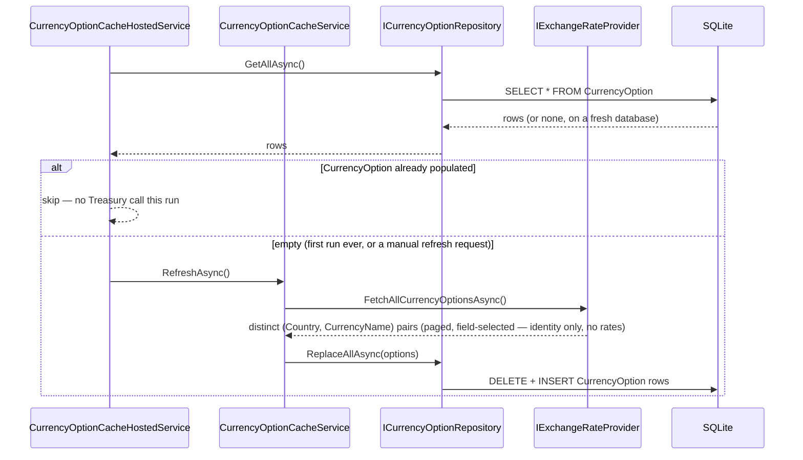
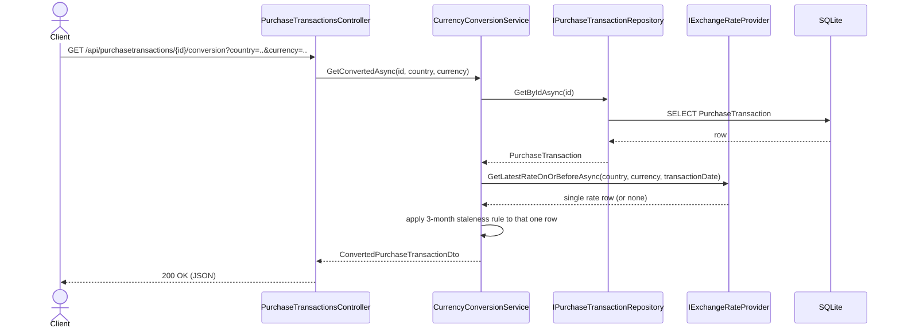

# WEX Purchasing Platform — Technical Design

This document builds on `InitialDesign.md` (problem statement, technology choices, and the resolved/open business-rule decisions) with the concrete internal architecture: layering, the repository pattern, DTOs/models, API surface, and cross-cutting concerns. Companion documents:

- [`ClassDiagram.md`](./ClassDiagram.md) — full class diagram (Mermaid)
- [`DatabaseDesign.md`](./DatabaseDesign.md) — schema (Mermaid ER diagram)
- [`ImplementationPhases.md`](./ImplementationPhases.md) — phased build plan
- [`CodingStandards.txt`](./CodingStandards.txt) — C# coding standards all code follows (see §11)

> **Outstanding item:** rounding convention is still unconfirmed with the client (see `InitialDesign.md` §5.2). `MoneyRounding.ToCurrency()` implements `AwayFromZero` as the default.

## 1. Solution structure

```
Wex.PurchasingPlatform.slnx
├── src/
│   ├── Wex.PurchasingPlatform.Api        (everything server-side — see §2 for its internal folders)
│   ├── Wex.PurchasingPlatform.Models     (DTOs only: requests, responses)
│   ├── Wex.PurchasingPlatform.Desktop    (WinForms front end, net10.0-windows, references Models)
│   └── Wex.PurchasingPlatform.Web        (Blazor front end, references Models)
└── tests/
    └── Wex.PurchasingPlatform.Tests      (all unit and integration tests)
```

`Models` is referenced by `Api`, `Desktop`, and `Web`. `Desktop` and `Web` each call the API over HTTP through their own `ApiClient/` folder.

## 2. Api project layout

```
Wex.PurchasingPlatform.Api/
├── Controllers/         PurchaseTransactionsController, CurrenciesController
├── Services/
│   ├── Interfaces/      IPurchaseTransactionService, ICurrencyConversionService, ICurrencyOptionCacheService
│   └── Implementation/  PurchaseTransactionService, CurrencyConversionService, CurrencyOptionCacheService, CurrencyOptionCacheHostedService
├── Repositories/
│   ├── Interfaces/      IRepository<T>, IPurchaseTransactionRepository, ICurrencyOptionRepository
│   └── Implementation/  Repository<T>, PurchaseTransactionRepository, CurrencyOptionRepository
├── Entities/            PurchaseTransaction, CurrencyOption
├── Data/                AppDbContext, EF Core configuration, migrations
├── ExternalServices/
│   ├── Interfaces/      IExchangeRateProvider
│   └── Implementation/  TreasuryExchangeRateClient
├── Common/              MoneyRounding
├── Validation/          FluentValidation validators
├── Middleware/          ValidationExceptionHandler (maps exceptions to ProblemDetails)
└── Program.cs           DI registration, middleware, Swagger, auth configuration
```

**Layering rule**: controllers call services; services call repositories and `IExchangeRateProvider`; repositories call `AppDbContext`.

```
Controller  →  Service  →  Repository  →  AppDbContext  →  SQLite
   │              │
   │              └──→  IExchangeRateProvider  →  Treasury Fiscal Data API
   │
   └──  only ever sees DTOs (Models project) in and out
```

`CurrencyConversionService` calls `IExchangeRateProvider` directly, live, once per conversion or per candidate-currency check (§5, §10) — there is no sync layer sitting between it and Treasury.

## 3. Models (DTOs)

All request/response shapes live in `Models` as plain records. See `ClassDiagram.md` for the full field list.

| DTO | Direction | Used by |
|---|---|---|
| `CreatePurchaseTransactionRequest` | in | `POST /api/purchasetransactions` |
| `UpdatePurchaseTransactionRequest` | in | `PUT /api/purchasetransactions/{id}` |
| `PurchaseTransactionDto` | out | create/read/update responses |
| `ConvertedPurchaseTransactionDto` | out | conversion endpoint |
| `CurrencyOptionDto` | out | currency-lookup endpoint (country + currency pairs valid for a given date) |

Controllers bind directly to these types. Services construct them from entities.

## 4. Repository pattern

One generic interface:

```csharp
public interface IRepository<TEntity> where TEntity : class
{
    Task<TEntity?> GetByIdAsync(object id, CancellationToken ct = default);
    Task<IReadOnlyList<TEntity>> GetAllAsync(CancellationToken ct = default);
    Task<TEntity> AddAsync(TEntity entity, CancellationToken ct = default);
    Task UpdateAsync(TEntity entity, CancellationToken ct = default);
    Task<bool> DeleteAsync(object id, CancellationToken ct = default);
}
```

- `Repository<TEntity> : IRepository<TEntity>` is the EF Core implementation. It holds `AppDbContext` and calls `SaveChangesAsync` on every write.
- `IPurchaseTransactionRepository : IRepository<PurchaseTransaction>` and `ICurrencyOptionRepository : IRepository<CurrencyOption>` both extend `IRepository<TEntity>`. `ICurrencyOptionRepository` adds one extra query, `GetByCountryAsync(country)`, used to fetch a country's candidate currency names before live-checking each against Treasury.
- `PurchaseTransactionRepository : Repository<PurchaseTransaction>, IPurchaseTransactionRepository` and `CurrencyOptionRepository : Repository<CurrencyOption>, ICurrencyOptionRepository` are the two concrete classes, registered in DI against their interfaces.

There is no exchange-rate repository or table at all — rates are never persisted locally (see §10). `CurrencyOption` only ever holds identity data (`Country`, `CurrencyName`). Full method signatures are in `ClassDiagram.md`; schema in `DatabaseDesign.md`.

## 5. Service layer

Three services, each depending only on repository interfaces:

- **`IPurchaseTransactionService` / `PurchaseTransactionService`** — create/read/update/delete for transactions: field validation (FluentValidation), rounding the purchase amount, mapping entity ↔ `PurchaseTransactionDto`.
- **`ICurrencyConversionService` / `CurrencyConversionService`** — calls `IExchangeRateProvider` directly and live, once per request; no local rate table is read. `GetConvertedAsync` loads the transaction (via `IPurchaseTransactionRepository`), calls `IExchangeRateProvider.GetLatestRateOnOrBeforeAsync(country, currencyName, transaction.TransactionDate)`, applies the rate-selection rule from `InitialDesign.md` §2.2 (most recent rate on or before the transaction date, flagged `isStale` past Treasury's documented 3-month window) to whatever single row comes back, and produces `ConvertedPurchaseTransactionDto`. `GetAvailableCurrenciesAsync(country, transactionDate)` reads that country's candidate currency names from `ICurrencyOptionRepository` (the small local identity cache) and live-checks each one against `IExchangeRateProvider` to filter down to what's actually usable as of that date.
- **`ICurrencyOptionCacheService` / `CurrencyOptionCacheService`** — the only consumer of `IExchangeRateProvider.FetchAllCurrencyOptionsAsync()`. `RefreshAsync` replaces the contents of `CurrencyOption` with the full distinct `(Country, CurrencyName)` set Treasury currently publishes — identity only, never rate values. Runs from `CurrencyOptionCacheHostedService` (a `BackgroundService`) at API startup **only if `CurrencyOption` is empty** (i.e., once, ever, on a fresh database) — see §8.1.

`PurchaseTransactionsController` and `CurrenciesController` call `IPurchaseTransactionService`/`ICurrencyConversionService`. `CurrenciesController` also calls `ICurrencyOptionCacheService` for `POST /api/currencies/refresh` (§6).

## 6. API surface

| Method | Route | Request | Response | Auth |
|---|---|---|---|---|
| POST | `/api/purchasetransactions` | `CreatePurchaseTransactionRequest` | `201` + `PurchaseTransactionDto` | required when enabled |
| GET | `/api/purchasetransactions` | — | `200` + `PurchaseTransactionDto[]` | required when enabled |
| GET | `/api/purchasetransactions/{id}` | — | `200` + `PurchaseTransactionDto` / `404` | required when enabled |
| PUT | `/api/purchasetransactions/{id}` | `UpdatePurchaseTransactionRequest` | `200` + `PurchaseTransactionDto` / `404` | required when enabled |
| DELETE | `/api/purchasetransactions/{id}` | — | `204` / `404` | required when enabled |
| GET | `/api/purchasetransactions/{id}/conversion` | query: `country`, `currency` | `200` + `ConvertedPurchaseTransactionDto` / `404` (no transaction) / `422` (no rate ever published for that currency on/before the transaction date) / `502` (Treasury unreachable) | required when enabled |
| GET | `/api/countries` | — | `200` + `string[]` (distinct countries in the local identity cache; no live Treasury call) | required when enabled |
| GET | `/api/currencies` | query: `country`, `transactionDate` | `200` + `CurrencyOptionDto[]` (that country's cached currencies, live-checked and filtered to what's usable as of `transactionDate`) | required when enabled |
| POST | `/api/currencies/refresh` | — | `202` (identity-cache refresh kicked off) | required when enabled |

Validation failures return `400` with an RFC 7807 `ProblemDetails` body (field name → message), from a shared exception-handling middleware.

## 7. Swagger / OpenAPI

- `Microsoft.AspNetCore.OpenApi` generates the spec; Swashbuckle's `SwaggerUI` (or Scalar) serves an interactive page at `/swagger`.
- XML doc comments on controllers/DTOs (`<GenerateDocumentationFile>`) feed the Swagger generator.
- When `Authentication:Enabled=true`, Swagger UI includes a JWT bearer security scheme for "Try it out" calls.

## 8. Request flow examples (sequence diagrams)

### 8.1 Startup currency-identity cache bootstrap (one-time)

Runs when the API process starts, but only does anything the very first time (or after a manual refresh) — see §10.



`POST /api/currencies/refresh` (§6) calls `CurrencyOptionCacheService.RefreshAsync()` directly, forcing the `else` branch on demand.

### 8.2 Conversion request



`GET /api/currencies?country=..&transactionDate=..` follows a similar shape: `CurrenciesController` → `CurrencyConversionService.GetAvailableCurrenciesAsync` → `ICurrencyOptionRepository.GetByCountryAsync(country)` (local, cheap) → one `IExchangeRateProvider.GetLatestRateOnOrBeforeAsync` call per candidate currency (bounded by that country's currency count, typically 1–3) → filtered `CurrencyOptionDto[]`.

## 9. Cross-cutting concerns

- **Validation**: FluentValidation validators in `Validation/`, one per request DTO, called by the service before the repository.
- **Error handling**: one exception-handling middleware maps exceptions to RFC 7807 `ProblemDetails` (`400` validation, `404` not found, `422` no rate ever published for that currency on/before the transaction date, `502` Treasury unreachable at request time).
- **Auth**: Microsoft Entra ID OAuth 2.0/OIDC, JWT bearer validation via `Microsoft.Identity.Web`, gated by `Authentication:Enabled` (default `false`) — see `InitialDesign.md` §2.4.
- **Money/rounding**: all rounding goes through `MoneyRounding.ToCurrency(decimal value)`.
- **Logging**: `Microsoft.Extensions.Logging` (`ILogger<T>`), configured via the `Logging` section of `appsettings.json` — Console and Debug providers, no third-party logging library. The exception-handling middleware logs every unhandled exception it converts to a `ProblemDetails` response. `CurrencyOptionCacheService` logs the one-time identity-cache refresh's start, row count, and outcome. `CurrencyConversionService` logs each live Treasury lookup's outcome (rate found/stale/not-found) and any Treasury-unreachable failure.

## 10. Exchange rate lookups — size and performance

No exchange-rate *values* are ever stored locally. The Treasury dataset is quarterly from March 2001 onward at roughly 150–190 rows per release — a full history of **15,000–20,000 rows** — but a given conversion only ever needs the single most recent row for one specific `(country, currency)` on or before one specific date. Pulling and maintaining the other ~14,999 rows to answer that one question is pure overhead: it costs startup time and disk space, and — since Treasury can revise published data with no change notification — carries a real risk of silently serving a stale local copy with no way to detect the drift.

- **Per-conversion lookup**: `TreasuryExchangeRateClient.GetLatestRateOnOrBeforeAsync` makes one HTTP call with server-side `filter`/`sort`/`page[size]=1` parameters, so Treasury itself does the narrowing and the response is a single row. Latency is dominated by the network round-trip (typically well under a second), not data volume.
- **Currency identity cache**: `CurrencyOption` holds only `(Country, CurrencyName)` — the universe of values Treasury has ever published, not their rates or dates. It's populated by exactly one field-selected crawl (`FetchAllCurrencyOptionsAsync`, requesting only the `country`/`currency` fields to keep the payload small), and that crawl runs **at most once**, guarded by "table is empty" — not on every startup. `POST /api/currencies/refresh` (§6) re-runs it manually if Treasury ever adds a new currency.
- **Currency picker**: `GET /api/currencies?country=..` reads that country's cached candidate names (typically 1–3, per `InitialDesign.md` §2.2's Eurozone/legacy-currency discussion) and live-checks each against Treasury — a handful of single-row lookups, not a scan of the full dataset.
- **Availability trade-off**: Requirement #2's endpoints now depend on Treasury being reachable at request time; an outage there returns `502` (§6/§9) instead of degrading to a stale local copy. Requirement #1 (storing transactions) never touches Treasury and is unaffected either way.

## 11. Coding standards

All C# code follows `CodingStandards.txt`. Standards that directly shape this design:

- Async methods are suffixed `Async` (§4/§5 already reflect this: `GetByIdAsync`, `SyncAsync`, etc.).
- Constructor injection only — every service and repository takes its dependencies through its constructor, never via `new` (§4/§5). Injected dependencies are declared as C# primary constructor parameters rather than a separate explicit constructor body.
- One type per file, file-scoped namespaces, explicit access modifiers on every member.
- No swallowed exceptions — the exception-handling middleware (§9) logs and maps every exception it catches; it never discards one.
- No magic numbers/strings — the 3-month staleness window (`InitialDesign.md` §2.2) and the description length limit (50 chars) are named constants, not literals repeated through the code.
- Log messages describe outcomes, not steps (§9) — e.g., "currency identity cache refreshed: 243 pairs" rather than "starting refresh."
- Interfaces are `I`-prefixed, classes/methods/properties are PascalCase, parameters/locals are camelCase, private fields are `_camelCase` — already the convention throughout `ClassDiagram.md`.

## Changelog

- Collapsed `Domain`, `Contracts`, `Application`, and `Infrastructure` into a single `Api` project, organized as folders.
- Renamed `Contracts` to `Models`.
- Removed the shared `ApiClient` project; each front end calls the API via its own `ApiClient/` folder.
- Collapsed four test projects into one `Wex.PurchasingPlatform.Tests`.
- Exchange-rate acquisition changed from per-request caching to a proactive startup sync.
- Sync bookkeeping: no separate sync-state table; the watermark is `MAX(RecordDate)`.
- Added §11, tying the design to `CodingStandards.txt`.
- Added logging (§9) using `Microsoft.Extensions.Logging`.
- `Repositories/` split into `Interfaces/` and `Implementation/` subfolders.
- Constructor-injected classes use C# primary constructors.
- `Services/` and `ExternalServices/` split into `Interfaces/`/`Implementation/`, matching `Repositories/`.
- Added `Common/` for shared stateless helpers (`MoneyRounding`).
- Reversed the earlier "per-request caching → proactive full sync" decision (see `DatabaseDesign.md`'s changelog) back to live per-request lookups, since a locally cached copy can silently drift from what Treasury currently publishes with no way to detect it. This time only currency *identities* (`Country`, `CurrencyName` — no rates, no dates) are cached, in a small `CurrencyOption` table populated by a one-time crawl, so the currency picker doesn't have to live-query Treasury for every currency that's ever existed on every request. Removed `ExchangeRateQuote`, `IExchangeRateRepository`/`ExchangeRateRepository`, `IExchangeRateSyncService`/`ExchangeRateSyncService`/`ExchangeRateSyncHostedService`, `ExchangeRatesController`, and `POST /api/exchange-rates/sync`. Added `CurrencyOption`, `ICurrencyOptionRepository`/`CurrencyOptionRepository`, `ICurrencyOptionCacheService`/`CurrencyOptionCacheService`/`CurrencyOptionCacheHostedService`, `GET /api/countries`, and `POST /api/currencies/refresh`; `GET /api/currencies` now takes a required `country` query param.

