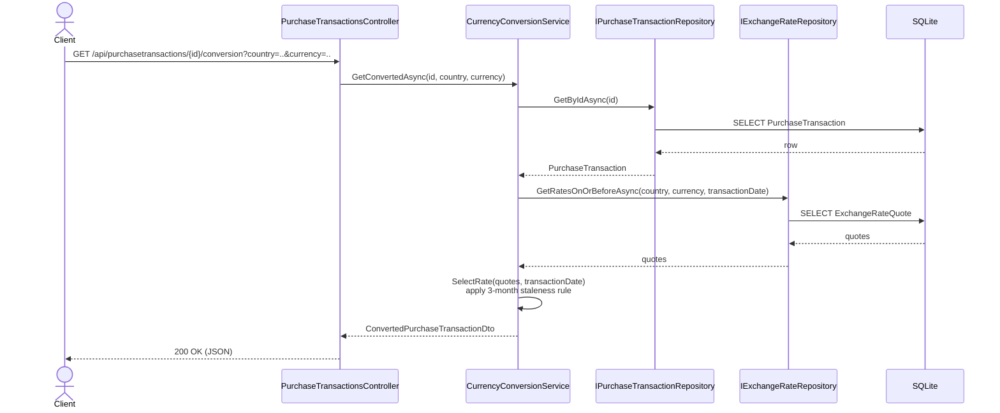

# WEX Purchasing Platform — Technical Design

This document builds on `InitialDesign.md` (problem statement, technology choices, and the resolved/open business-rule decisions) with the concrete internal architecture: layering, the repository pattern, DTOs/models, API surface, and cross-cutting concerns. Companion documents:

- [`ClassDiagram.md`](./ClassDiagram.md) — full class diagram (Mermaid)
- [`DatabaseDesign.md`](./DatabaseDesign.md) — schema (Mermaid ER diagram)
- [`ImplementationPhases.md`](./ImplementationPhases.md) — phased build plan
- [`CodingStandards.txt`](./CodingStandards.txt) — C# coding standards all code follows (see §11)

> **Outstanding item:** rounding convention is still unconfirmed with the client (see `InitialDesign.md` §5.2). `MoneyRounding.ToCurrency()` implements `AwayFromZero` as the default.

## 1. Solution structure

```
Wex.PurchasingPlatform.slnx
├── src/
│   ├── Wex.PurchasingPlatform.Api        (everything server-side — see §2 for its internal folders)
│   ├── Wex.PurchasingPlatform.Models     (DTOs only: requests, responses)
│   ├── Wex.PurchasingPlatform.Desktop    (WinForms front end, net10.0-windows, references Models)
│   └── Wex.PurchasingPlatform.Web        (Blazor front end, references Models)
└── tests/
    └── Wex.PurchasingPlatform.Tests      (all unit and integration tests)
```

`Models` is referenced by `Api`, `Desktop`, and `Web`. `Desktop` and `Web` each call the API over HTTP through their own `ApiClient/` folder.

## 2. Api project layout

```
Wex.PurchasingPlatform.Api/
├── Controllers/         PurchaseTransactionsController, CurrenciesController, ExchangeRatesController
├── Services/            IPurchaseTransactionService, ICurrencyConversionService, IExchangeRateSyncService
│                        + their implementations, ExchangeRateSyncHostedService
├── Repositories/
│   ├── Interfaces/      IRepository<T>, IPurchaseTransactionRepository, IExchangeRateRepository
│   └── Implementation/  Repository<T>, PurchaseTransactionRepository, ExchangeRateRepository
├── Entities/            PurchaseTransaction, ExchangeRateQuote
├── Data/                AppDbContext, EF Core configuration, migrations
├── ExternalServices/    IExchangeRateProvider, TreasuryExchangeRateClient
├── Validation/          FluentValidation validators
└── Program.cs           DI registration, middleware, Swagger, auth configuration
```

**Layering rule**: controllers call services; services call repositories and `IExchangeRateProvider`; repositories call `AppDbContext`.

```
Controller  →  Service  →  Repository  →  AppDbContext  →  SQLite
   │              │
   │              └──→  IExchangeRateProvider  →  Treasury Fiscal Data API
   │
   └──  only ever sees DTOs (Models project) in and out
```

## 3. Models (DTOs)

All request/response shapes live in `Models` as plain records. See `ClassDiagram.md` for the full field list.

| DTO | Direction | Used by |
|---|---|---|
| `CreatePurchaseTransactionRequest` | in | `POST /api/purchasetransactions` |
| `UpdatePurchaseTransactionRequest` | in | `PUT /api/purchasetransactions/{id}` |
| `PurchaseTransactionDto` | out | create/read/update responses |
| `ConvertedPurchaseTransactionDto` | out | conversion endpoint |
| `CurrencyOptionDto` | out | currency-lookup endpoint (country + currency pairs valid for a given date) |

Controllers bind directly to these types. Services construct them from entities.

## 4. Repository pattern

One generic interface:

```csharp
public interface IRepository<TEntity> where TEntity : class
{
    Task<TEntity?> GetByIdAsync(object id, CancellationToken ct = default);
    Task<IReadOnlyList<TEntity>> GetAllAsync(CancellationToken ct = default);
    Task<TEntity> AddAsync(TEntity entity, CancellationToken ct = default);
    Task UpdateAsync(TEntity entity, CancellationToken ct = default);
    Task<bool> DeleteAsync(object id, CancellationToken ct = default);
}
```

- `Repository<TEntity> : IRepository<TEntity>` is the EF Core implementation. It holds `AppDbContext` and calls `SaveChangesAsync` on every write.
- `IPurchaseTransactionRepository : IRepository<PurchaseTransaction>` and `IExchangeRateRepository : IRepository<ExchangeRateQuote>` both extend `IRepository<TEntity>`. `IExchangeRateRepository` adds three exchange-rate-specific queries: most-recent-rate-on-or-before-a-date, distinct country/currency pairs available as of a date, and the latest stored `record_date`.
- `PurchaseTransactionRepository : Repository<PurchaseTransaction>, IPurchaseTransactionRepository` and `ExchangeRateRepository : Repository<ExchangeRateQuote>, IExchangeRateRepository` are the two concrete classes, registered in DI against their interfaces.

`IExchangeRateRepository.GetLatestRecordDateAsync()` (a `MAX(RecordDate)` query) is how the sync service finds the newest data already stored. Full method signatures are in `ClassDiagram.md`; schema in `DatabaseDesign.md`.

## 5. Service layer

Three services, each depending only on repository interfaces:

- **`IPurchaseTransactionService` / `PurchaseTransactionService`** — create/read/update/delete for transactions: field validation (FluentValidation), rounding the purchase amount, mapping entity ↔ `PurchaseTransactionDto`.
- **`ICurrencyConversionService` / `CurrencyConversionService`** — reads against the synced `ExchangeRateQuote` table via `IExchangeRateRepository`. `GetConvertedAsync` loads the transaction (via `IPurchaseTransactionRepository`), applies the rate-selection rule from `InitialDesign.md` §2.2 (most recent rate on or before the transaction date, flagged `isStale` past Treasury's documented 3-month window), and produces `ConvertedPurchaseTransactionDto`. `GetAvailableCurrenciesAsync` returns the country/currency pairs with a usable rate as of a given date, for the front end's cascading dropdown.
- **`IExchangeRateSyncService` / `ExchangeRateSyncService`** — the only consumer of `IExchangeRateProvider` (the Treasury HTTP client). `SyncAsync` calls `IExchangeRateRepository.GetLatestRecordDateAsync()`, fetches anything newer from Treasury, and upserts it into `ExchangeRateQuote`. Runs from `ExchangeRateSyncHostedService` (a `BackgroundService`) once at API startup — see §8.1.

`PurchaseTransactionsController` and `CurrenciesController` call `IPurchaseTransactionService`/`ICurrencyConversionService`. `ExchangeRatesController` calls `IExchangeRateSyncService` for `POST /api/exchange-rates/sync` (§6).

## 6. API surface

| Method | Route | Request | Response | Auth |
|---|---|---|---|---|
| POST | `/api/purchasetransactions` | `CreatePurchaseTransactionRequest` | `201` + `PurchaseTransactionDto` | required when enabled |
| GET | `/api/purchasetransactions` | — | `200` + `PurchaseTransactionDto[]` | required when enabled |
| GET | `/api/purchasetransactions/{id}` | — | `200` + `PurchaseTransactionDto` / `404` | required when enabled |
| PUT | `/api/purchasetransactions/{id}` | `UpdatePurchaseTransactionRequest` | `200` + `PurchaseTransactionDto` / `404` | required when enabled |
| DELETE | `/api/purchasetransactions/{id}` | — | `204` / `404` | required when enabled |
| GET | `/api/purchasetransactions/{id}/conversion` | query: `country`, `currency` | `200` + `ConvertedPurchaseTransactionDto` / `404` (no transaction) / `422` (no rate ever available) | required when enabled |
| GET | `/api/currencies` | query: `transactionDate` | `200` + `CurrencyOptionDto[]` | required when enabled |
| POST | `/api/exchange-rates/sync` | — | `202` (sync kicked off) | required when enabled |

Validation failures return `400` with an RFC 7807 `ProblemDetails` body (field name → message), from a shared exception-handling middleware.

## 7. Swagger / OpenAPI

- `Microsoft.AspNetCore.OpenApi` generates the spec; Swashbuckle's `SwaggerUI` (or Scalar) serves an interactive page at `/swagger`.
- XML doc comments on controllers/DTOs (`<GenerateDocumentationFile>`) feed the Swagger generator.
- When `Authentication:Enabled=true`, Swagger UI includes a JWT bearer security scheme for "Try it out" calls.

## 8. Request flow examples (sequence diagrams)

### 8.1 Startup sync

Runs once when the API process starts, and on demand via `POST /api/exchange-rates/sync` (§6).

```mermaid
sequenceDiagram
    participant Host as ExchangeRateSyncHostedService
    participant SyncSvc as ExchangeRateSyncService
    participant RateRepo as IExchangeRateRepository
    participant Treasury as IExchangeRateProvider
    participant DB as SQLite

    Host->>SyncSvc: SyncAsync()
    SyncSvc->>RateRepo: GetLatestRecordDateAsync()
    RateRepo->>DB: SELECT MAX(RecordDate) FROM ExchangeRateQuote
    DB-->>RateRepo: latest date (or null, on first run)
    RateRepo-->>SyncSvc: latest date

    SyncSvc->>Treasury: FetchRatesAsync(sinceDate: latest date)
    Treasury-->>SyncSvc: new/changed quotes (paged; looped until exhausted)

    SyncSvc->>RateRepo: UpsertRangeAsync(quotes)
    RateRepo->>DB: INSERT/UPDATE ExchangeRateQuote rows
```

### 8.2 Conversion request



`GET /api/currencies` follows the same shape minus the transaction lookup: `CurrenciesController` → `CurrencyConversionService.GetAvailableCurrenciesAsync` → `IExchangeRateRepository` → SQLite.

## 9. Cross-cutting concerns

- **Validation**: FluentValidation validators in `Validation/`, one per request DTO, called by the service before the repository.
- **Error handling**: one exception-handling middleware maps exceptions to RFC 7807 `ProblemDetails` (`400` validation, `404` not found, `422` no rate available).
- **Auth**: Microsoft Entra ID OAuth 2.0/OIDC, JWT bearer validation via `Microsoft.Identity.Web`, gated by `Authentication:Enabled` (default `false`) — see `InitialDesign.md` §2.4.
- **Money/rounding**: all rounding goes through `MoneyRounding.ToCurrency(decimal value)`.
- **Logging**: `Microsoft.Extensions.Logging` (`ILogger<T>`), configured via the `Logging` section of `appsettings.json` — Console and Debug providers, no third-party logging library. The exception-handling middleware logs every unhandled exception it converts to a `ProblemDetails` response. `ExchangeRateSyncService` logs each sync run's start, row count, and outcome. `CurrencyConversionService` logs when it returns a stale rate.

## 10. Exchange rate sync — size and performance

The Treasury dataset is quarterly from March 2001 onward at roughly 150–190 rows per release — a full history of **15,000–20,000 rows**. The first-run sync pulls all of it, not a recent window: at this size, a full pull and a windowed pull cost about the same (a few seconds, a few MB), but a windowed pull would need a second code path to backfill any transaction dated outside the window — full history avoids that case entirely instead of deferring it.

- `IExchangeRateRepository.GetLatestRecordDateAsync()` returns `null` only on the first startup against an empty database, which triggers the one full historical pull. Every later startup fetches only `record_date` values newer than what's stored — at most one new quarterly release.
- `TreasuryExchangeRateClient.FetchRatesAsync` pages through the Treasury API until exhausted. Writes are batched: one `AddRangeAsync` (chunked, e.g. 1,000 rows) per batch, one `SaveChangesAsync` per batch.
- The sync runs in a startup `BackgroundService`, not inline in the request pipeline: `PurchaseTransaction` CRUD (Requirement #1) works even if the initial sync fails or Treasury is unreachable. A failed sync is logged and retried on the next manual `POST /api/exchange-rates/sync` or process restart.

## 11. Coding standards

All C# code follows `CodingStandards.txt`. Standards that directly shape this design:

- Async methods are suffixed `Async` (§4/§5 already reflect this: `GetByIdAsync`, `SyncAsync`, etc.).
- Constructor injection only — every service and repository takes its dependencies through its constructor, never via `new` (§4/§5). Injected dependencies are declared as C# primary constructor parameters rather than a separate explicit constructor body.
- One type per file, file-scoped namespaces, explicit access modifiers on every member.
- No swallowed exceptions — the exception-handling middleware (§9) logs and maps every exception it catches; it never discards one.
- No magic numbers/strings — the 3-month staleness window (`InitialDesign.md` §2.2) and the description length limit (50 chars) are named constants, not literals repeated through the code.
- Log messages describe outcomes, not steps (§9) — e.g., "sync completed: 187 rows" rather than "starting sync."
- Interfaces are `I`-prefixed, classes/methods/properties are PascalCase, parameters/locals are camelCase, private fields are `_camelCase` — already the convention throughout `ClassDiagram.md`.

## Changelog

- Collapsed `Domain`, `Contracts`, `Application`, and `Infrastructure` into a single `Api` project, organized as folders.
- Renamed `Contracts` to `Models`.
- Removed the shared `ApiClient` project; each front end calls the API via its own `ApiClient/` folder.
- Collapsed four test projects into one `Wex.PurchasingPlatform.Tests`.
- Exchange-rate acquisition changed from per-request caching to a proactive startup sync.
- Sync bookkeeping: no separate sync-state table; the watermark is `MAX(RecordDate)`.
- Added §11, tying the design to `CodingStandards.txt`.
- Added logging (§9) using `Microsoft.Extensions.Logging`.
- `Repositories/` split into `Interfaces/` and `Implementation/` subfolders.
- Constructor-injected classes use C# primary constructors.

